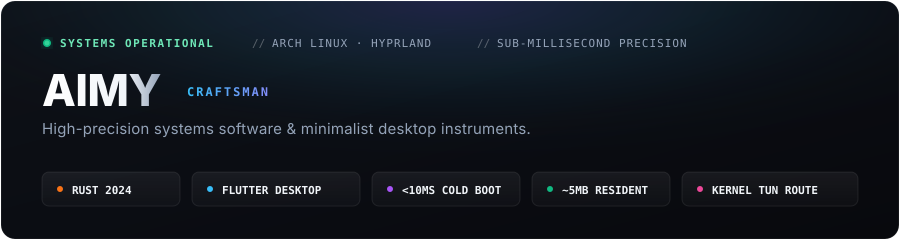

  

 

> **"Crafting high-precision systems software and minimalist desktop instruments.  
> Obsessed with sub-millisecond latency, zero-bloat runtime, and keyboard-driven ergonomics."**

---

### ✦ Curated Instruments (核心作品矩阵)

<table width="100%">
  <tr>
    <td width="34%" valign="top">
      <b><a href="https://github.com/aimy1/Rune">⚡ Rune</a></b> 
      Terminal Launcher &amp; Desk 
      <code>Rust 2024</code> · <code>Ratatui</code> · <code>Sixel</code>
    </td>
    <td width="66%" valign="top">
      键盘驱动的 Linux 终端极速启动器与工作台。毫秒级应用索引直达，Dolphin 风格双栏响应式文件管理（原生支持 Sixel/Kitty 字符与高清图像直出），内嵌 SSH 快速会话、容器管理与终端内嵌 AI 助手。
    </td>
  </tr>
  <tr>
    <td width="34%" valign="top">
      <b><a href="https://github.com/aimy1/Mimo">🛡️ Mimo</a></b> 
      TUN Proxy Controller 
      <code>Rust 2024</code> · <code>TUN Mode</code> · <code>&lt;10ms</code>
    </td>
    <td width="66%" valign="top">
      极轻量内核级终端代理控制中心。冷启动瞬时响应 <b>&lt;10ms</b>，常驻内存仅 <b>~5MB</b>，全局三层透明网络接管，无缝协同 Hyprland / Wayland 桌面环境。
    </td>
  </tr>
  <tr>
    <td width="34%" valign="top">
      <b><a href="https://github.com/aimy1/tune">🎵 tune</a></b> 
      Terminal Music Instrument 
      <code>Rust</code> · <code>MPRIS</code> · <code>Braille FFT</code>
    </td>
    <td width="66%" valign="top">
      现代化分栏 Linux 终端网易云音乐播放器。Kitty / Sixel 协议超高清专辑封面直出，平滑阻尼弹性动效，实时 Braille 盲文音频波形图谱与全局多媒体按键调度。
    </td>
  </tr>
  <tr>
    <td width="34%" valign="top">
      <b><a href="https://github.com/aimy1/Wmimo">🌐 Wmimo</a></b> 
      Desktop Proxy Client 
      <code>Flutter 3.x</code> · <code>Mihomo</code> · <code>Tray</code>
    </td>
    <td width="66%" valign="top">
      天青蓝品牌美学跨平台网络代理客户端。全功能系统托盘集成（实时上下行流速面板、毫秒级一键测速、节点无感热切），深度驱动 Mihomo 高性能内核。
    </td>
  </tr>
  <tr>
    <td width="34%" valign="top">
      <b><a href="https://github.com/aimy1/Marka">📝 Marka IDE</a></b> 
      Workspace Markdown Studio 
      <code>Flutter Desktop</code> · <code>Catppuccin</code>
    </td>
    <td width="66%" valign="top">
      专为专注写作打造的工业美学 Markdown 编辑器。5万+字大文本秒开秒滚无延迟，VS Code 风格树状工作区配置架构，Linux (RPM / AppImage / DEB) 与 macOS / Windows 原生打包。
    </td>
  </tr>
</table>

---

### ✦ Toolchain & Environment

  

---

### ✦ Telemetry & Activity (战绩数据)

  <table border="0" style="border: none;">
    <tr>
      <td width="50%" align="center" style="border: none;">
        
      </td>
      <td width="50%" align="center" style="border: none;">
        
      </td>
    </tr>
  </table>

  

---

### ✦ Fuel the Machine

  
<b>支持独立开发者的开源探索 (USDT / Crypto)</b>

   
  

    <table>
      <tr>
        <td align="center" width="200">
           
          <b>扫码转入 USDT</b>
        </td>
        <td align="left">
          
💰 <b>资产币种：</b> <code>USDT</code>

          
🌐 <b>所属网络：</b> <code>APTOS (CHAIN ID: 1)</code>

          
📫 <b>钱包地址：</b> 
          <code>0xce0c3a1d7d8547eb7effd887095da438b89e3edd70e7c7e7927c244c2dd7f345</code>

          
⚠️ 转账时请确认选择 <b>APTOS</b> 链网络。感谢对开源项目的认可与支持！

        </td>
      </tr>
    </table>
  

 

  AIMY · ARCH LINUX &amp; HYPRLAND · CRAFTED WITH SUB-MILLISECOND PRECISION

